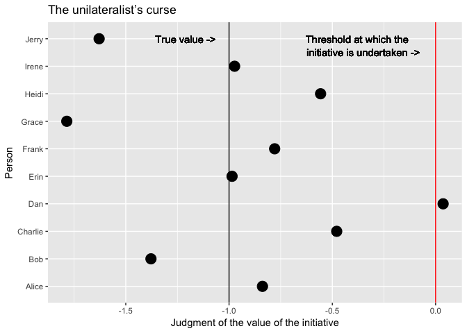

The Unilateralist’s Curse – Summary and Commentary
================
David Laing
2016-12-31

In social epistemology, there is a phenomenon called the *unilateralist's curse*. It occurs when...

-   There is a group of altruistic decision-makers, *and*...
-   Each of them must independently decide whether to undertake a given initiative, *and*...
-   The value of the initiative is ambiguous; that is, there is some variance in people's judgments of the initiative's value, *and*...
-   The true value of the initiative is negative.

The curse is that in these situations, negative initiatives will be undertaken more often than they should be. This happens because all that is required for the initiative to be undertaken is for a single agent to decide that it would do some good. And there are three potential conditions that could lead to this:

-   The variance of the judgments is especially high, *or*...
-   The sample mean judgment is especially close to zero (i.e. neutral — the initiative does neither harm nor good), *or*...
-   There are especially many agents making the judgment of whether or not to undertake the initiative.

Say there are ten people, each of whom has access to some sort of ethically ambiguous classified government information. Each of them has the option of leaking it. For the sake of argument, let's assume that leaking the information would do more harm than good. Since crowds are usually smart, the average judgment of the value of leaking the information will be negative, thus cause most people to correctly withold the information. Unfortunately, all it takes is a single person to leak the information:

