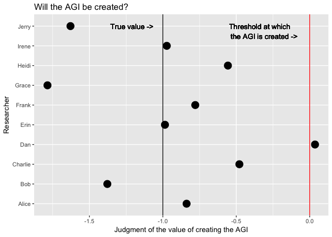

The Unilateralist’s Curse – Summary and Commentary
================
David Laing
2016-12-31

Imagine it's the year 2070, and among the thousands of computer scientists in the world, there are now ten who have independently figured out how to create an artificial general intelligence (AGI). None of them have gone ahead with it yet. They're all trying to ascertain whether such a development would be good or bad for humanity.

Each of these ten researchers is familiar with the intricate difficulties of the control problem, and each of them believes they may have made enough headway on it that the AGI could be created safely. But none of them are 100% certain that their specifications are perfect. So they must all weigh the potential consequences of a) creating a misalligned AGI, or b) delaying their own best attempt at an alligned AGI, with the risk that someone else will try first but fail catastrophically.

Let's say none of them have quite solved the control problem, and thus if any one of them goes through with the initiative, the consequences will be harmful. Crowds are smart, and the average judgment of the value of creating the AGI will probably be correct. But there is some variance in these judgments, and if the variance is large enough, there may be one or two researchers who incorrectly decide to proceed.

This is an example the *unilateralist's curse*, a phenomemon described in a [2016 paper](http://dx.doi.org/10.1080/02691728.2015.1108373) by Nick Bostrom, Thomas Douglas, and Anders Sandberg. The curse occurs when...

-   There is a group of altruistic decision-makers.
-   Each of them must independently decide whether to undertake a given initiative.
-   The value of the initiative is ambiguous; that is, there is some variance in people's judgments of the initiative's value.
-   The true value of the initiative is negative.

The curse is that the average judgment of the value of the initiative doesn't determine whether the initiative will be undertaken; instead, the *maximum* judgment does. All that is required for the initiative to be undertaken is for a single agent to decide that it would do some good. And there are three potential conditions that could lead to this:

-   The variance of the judgments is especially high.
-   The sample mean judgment is especially close to zero (i.e. neutral — the initiative does neither harm nor good).
-   There are especially many agents making the judgment of whether or not to undertake the initiative.

Note: points for further discussion:

-   when should certain individuals capabable of undertaking the initiative be excluded from a majority vote?
-   when should certain individuals incapable of undertaking the initiative be included in a majority vote?
